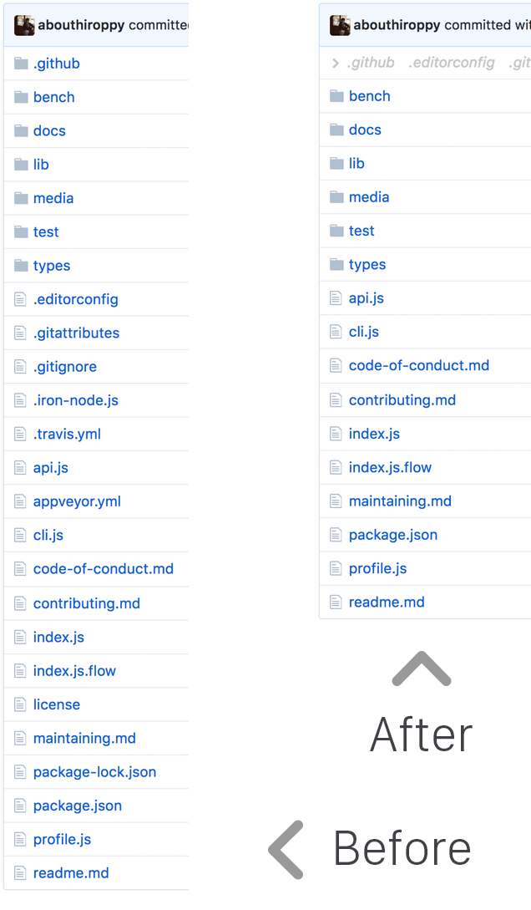

# Hide Files on GitHub

> Chrome extension - Hide dotfiles from the GitHub file browser

In the options, you can choose between hiding or dimming files matching a custom regex.

## Install

Install it from the [Chrome Web Store](https://chrome.google.com/webstore/detail/hide-files-on-github/lpnakhpaodhdkleejaehlapdhbgjbddp) or [manually](http://superuser.com/a/247654/6877).

## License

MIT © [Sindre Sorhus](https://sindresorhus.com)

